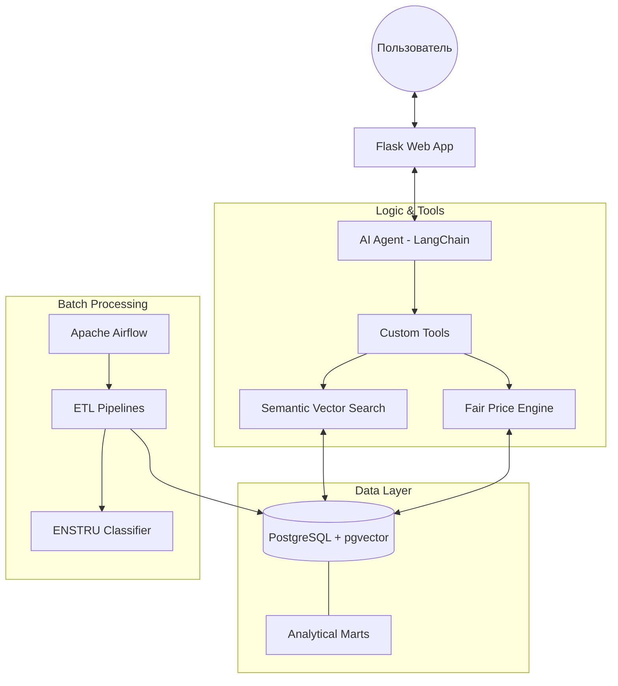

# 🛡️ Интеллектуальный помощник по государственным закупкам РК

Проект представляет собой ИИ-агента для анализа аномалий в государственных закупках Республики Казахстан. Система использует современные методы машинного обучения (Isolation Forest) и статистического анализа (Fair Price) для выявления завышения цен и нетипичных объемов закупок.

---

## 📂 Описание файлов проекта

| Файл | Описание |
| :--- | :--- |
| `agent.py` | Основная логика ИИ-агента на базе LangChain и OpenAI. Содержит инструменты (tools) для работы с БД. |
| `app.py` / `app_safe.py` | Flask-приложение (бэкенд) для веб-интерфейса чат-бота. |
| `architecture.html` | Визуализация архитектуры системы с использованием Mermaid.js. |
| `fair_price.py` | Модуль расчета «Справедливой цены» с учетом инфляции, региона и сезонности. |
| `ml_anomaly_detection.py` | Скрипт обнаружения многомерных аномалий с помощью Isolation Forest (scikit-learn). |
| `build_embeddings.py` | Создание векторных представлений (embeddings) названий лотов для семантического поиска. |
| `enstru_classifier.py` | Классификатор товаров по кодам ЕНСТРУ на основе LLM или правил. |
| `loader.py` / `load_contracts.py` | Скрипты для ETL-процессов: загрузка данных с портала госзакупок в PostgreSQL. |
| `init_fair_price.py` | Инициализация справочных таблиц (регионы, инфляция) и наполнение аналитических витрин. |
| `Dockerfile` / `docker-compose.yml` | Конфигурация для контейнеризации приложения и базы данных. |
| `requirements.txt` | Список зависимостей Python. |
| `airflow_dags/` | Директория с DAG-файлами для автоматизации ETL-процессов в Apache Airflow. |

---

## 🏗️ 1. Архитектурное описание

Система построена на модульном принципе с разделением на уровни сбора данных, обработки и взаимодействия с пользователем.

### Основные компоненты:
*   **Интерфейс**: Flask Web App с поддержкой сессий и истории диалога.
*   **ИИ-Агент**: Реализован по паттерну ReAct (Reason + Act), использует GPT-4o-mini для выбора инструментов и формирования ответов.
*   **Слой данных**: PostgreSQL с расширением `pgvector` для семантического поиска товаров.
*   **Оркестрация**: Apache Airflow управляет регулярным обновлением данных и пересчетом ML-моделей.

---

## 📊 2. Схема хранения данных

Данные организованы в виде классического хранилища (DWH) с выделенными аналитическими витринами (marts).

### Основные таблицы:
*   `purchases`: Общая информация об объявлениях (номер, заказчик, БИН, КАТО).
*   `core_lots_cleaned`: Очищенные данные по лотам (наименование, ЕНСТРУ, цена за единицу, количество).
*   `contracts`: Информация о подписанных договорах и победителях.
*   `lot_embeddings`: Векторные представления названий товаров для `pgvector`.

### Аналитические витрины:
*   `mart_fair_price`: Содержит предварительно рассчитанные показатели отклонения от справедливой цены для каждого лота.
*   `mart_ml_anomalies`: Результаты работы модели Isolation Forest по выявлению сложных аномалий «цена + объем».

---

## 📈 3. Описание аналитики и метрик

### Fair Price (Справедливая цена)
Центральная метрика оценки адекватности стоимости товара.
**Формула:** `Fair Price = Baseline × Region × Inflation × Seasonality`
*   **Baseline**: Медианная цена категории ЕНСТРУ за отчетный год.
*   **Region**: Коэффициент стоимости жизни/логистики в конкретном регионе (по кодам КАТО).
*   **Inflation**: Поправка на временной лаг (индекс инфляции по кварталам).
*   **Seasonality**: Учет сезонных колебаний цен на определенные группы товаров.

### ML-метрики:
1.  **Isolation Forest Score**: Оценка степени «изолированности» закупки в многомерном пространстве параметров. Позволяет находить аномалии, которые не видны при простом сравнении цен.
2.  **Z-Score (Volume)**: Статистическое отклонение объема закупки от среднего исторического профиля заказчика.

---

## 💬 4. Примеры ответов AI-агента

### Пример 1 (RU): Поиск ценовых аномалий
> **Вердикт**: Выявлено критическое завышение цены на канцтовары в Акмолинской области.
> **Использованные данные**: Анализ 15 закупок по коду ЕНСТРУ 36101500 за 2024 год.
> **Сравнение**: Цена заказчика «Школа №1» составляет 5,000 тг, в то время как Справедливая цена — 1,200 тг (превышение в 4.1 раза).
> **Метрика**: Fair Price.

### Пример 2 (KZ): Ұйымның сенімділігін тексеру
> **Үкім**: «Компания Х» сатып алуларында аномалиялар деңгейі төмен (8%).
> **Бағалау метрикасы**: Справедливая цена (Fair Price).
> **Дегжей-тегжей**: Соңғы 10 лоттың ішінде тек 1 лотта бағаның 15% ауытқуы байқалды.

---

## 🚧 5. Перечень рисков и ограничений

1.  **Качество входных данных**: Ошибки или намеренное искажение наименований товаров заказчиками могут приводить к неправильной классификации ЕНСТРУ.
2.  **Галлюцинации LLM**: Риск минимизируется за счет использования жестких SQL-запросов к проверенным витринам данных, ИИ выступает лишь интерпретатором результатов.
3.  **Временной лаг**: Аналитика базируется на уже опубликованных или завершенных процедурах, что не позволяет предотвратить нарушение в реальном времени до публикации лота (но позволяет выявить его постфактум).
4.  **Вычислительная сложность**: Поиск по векторам и обучение моделей требует значительных ресурсов при масштабировании на миллионы записей.
